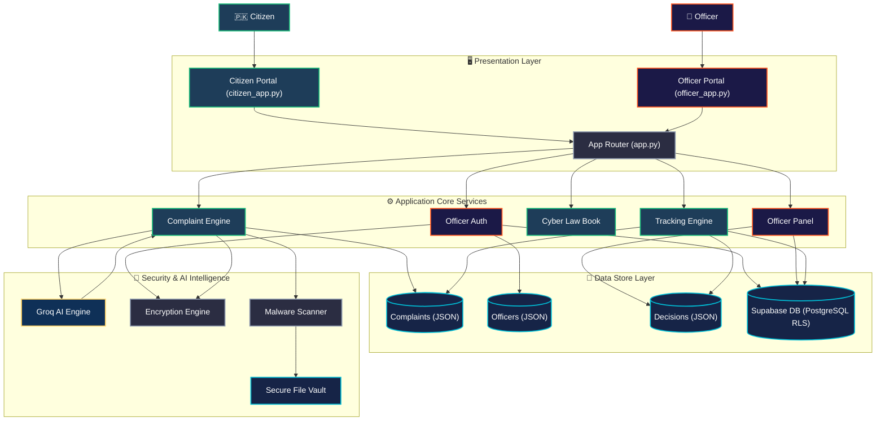
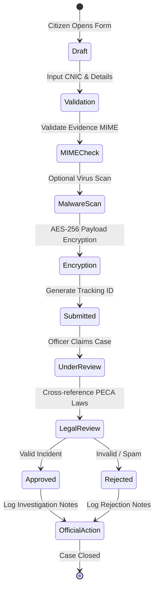

# 🛡️ National Cyber Crime Reporting System (CCRS) - Pakistan

### *A Secure, Government-Grade Incident Management and Electronic Evidence Forensic Archiving Portal*

---

<div align="center">

[](https://github.com/hamzaali-712/cyber-crime-reporting-system/)
[](https://www.python.org/)
[](https://streamlit.io/)
[](https://fastapi.tiangolo.com/)
[](https://supabase.com/)
[](https://groq.com/)
[](https://na.gov.pk/uploads/documents/1472635250_246.pdf)
[](#-security-hardening--cybersecurity-controls)

</div>

---

## 📋 Table of Contents
1. [🌐 Live System Deployments](#-live-system-deployments)
2. [🌟 Key Capabilities & Features](#-key-capabilities--features)
3. [⚙️ Unified Architecture & Technical Workflows](#%EF%B8%8F-unified-architecture--technical-workflows)
4. [🛠️ Technical Stack & Dependencies](#%EF%B8%8F-technical-stack--dependencies)
5. [📂 Directory Blueprint](#-directory-blueprint)
6. [🔒 Security Hardening & Cybersecurity Controls](#-security-hardening--cybersecurity-controls)
7. [🚀 Local Development Setup Guide](#-local-development-setup-guide)
8. [🧪 Testing & Quality Assurance](#-testing--quality-assurance)
9. [⚖️ PECA 2016 Legal Framework Compliance](#%EF%B8%8F-peca-2016-legal-framework-compliance)
10. [🤝 Contributing & Support](#-contributing--support)

---

## 🌐 Live System Deployments

The CCRS architecture is divided into two operational environments. Below are the separate workspaces for development and final production:

### 🛠️ Working Development Environment
This is the active development environment for testing experimental features and continuous integrations.

| Portal Node | Repository | Live Deployment URL |
| :--- | :--- | :--- |
| **🛡️ Citizen Reporting Portal** | [hamzaali-712/cyber-crime-reporting-system](https://github.com/hamzaali-712/cyber-crime-reporting-system/) | [🔗 cyber-crime-reporting-system-sre.streamlit.app](https://cyber-crime-reporting-system-sre.streamlit.app/) |
| **👮 Officer Command Panel** | [hamzaali-712/cyber-crime-reporting-system](https://github.com/hamzaali-712/cyber-crime-reporting-system/) | [🔗 ccrs-officer-command.streamlit.app](https://ccrs-officer-command.streamlit.app/) |

### 🚀 Final Production Environment
This is the stable, production-grade node deployed for official access.

| Portal Node | Repository | Live Deployment URL |
| :--- | :--- | :--- |
| **📦 Production Core Repo (Fork)** | [FarukhMumtaz/CyberCrime-IS](https://github.com/FarukhMumtaz/CyberCrime-IS) | *Internal Production Engine* |
| **🛡️ Production Citizen Node** | [FarukhMumtaz/CyberCrime-IS](https://github.com/FarukhMumtaz/CyberCrime-IS) | [🔗 cybercrme-userport.streamlit.app](https://cybercrme-userport.streamlit.app/) |
| **👮 Production Officer Node** | [FarukhMumtaz/CyberCrime-IS](https://github.com/FarukhMumtaz/CyberCrime-IS) | [🔗 cybercrime-officerport.streamlit.app](https://cybercrime-officerport.streamlit.app/) |

---

## 🌟 Key Capabilities & Features

### 1. 🛡️ Citizen Incident Desk (`views/report_form.py`)
* **Flexible Reporting Modes**: Support for anonymous reporting or verified submission using secure CNIC (National Identity Card) validation.
* **Smart Incident Forms**: Intuitive, step-by-step submission pages with input sanitization, dynamic validations, and secure temporary files creation.
* **Instant Tracking Engine**: Auto-generates cryptographic Tracking IDs upon submission, enabling users to trace progress in real-time.

### 2. 👮 Officer Decision Workstation (`views/officer_panel.py`)
* **Secure Officer Authentication**: Robust registration and login mechanism featuring auto-generated high-impact Officer IDs (e.g., `CYBER2026HAMZA`) with cryptographic password verification.
* **Case Management Dashboard**: Dynamic queue displaying pending, active, and completed complaints.
* **Actionable Adjudication Flow**: Officers can easily review complaint summaries, verify evidence, update case statuses (`Approved` / `Rejected`), and append official investigation notes.
* **Operational Telemetry Charts**: Visually rich dashboard metrics illustrating monthly resolution rates, category proportions, and general performance indicators.

### 3. 📚 Cyber Law Guide (`views/law_guide.py` & `data/cyber_laws.py`)
* **PECA Law Encyclopedia**: 17 complete Pakistan Prevention of Electronic Crimes Act (PECA) 2016 laws mapped directly into the system.
* **Intelligent Query Filter**: High-performance legal search bar allowing citizens to filter offenses by description, severity level, jail sentence length, or fine amount.
* **Penalty Calculator**: Displays clear official punishments, giving citizens rapid, reliable legal context.

### 4. 🤖 Groq-powered AI Cyber Assistant (`components/chatbot.py`)
* **Natural Language Inquiry**: Integrated chat module where users can describe their situations and receive supportive, informative legal advice.
* **Automated Complaint Classification**: The AI analyzes incident details and automatically tags the relevant PECA legal section (e.g. Identity Theft, Cyber Bullying, Ransomware) to assist non-technical citizens.
* **Summarization Services**: Distills complex incident text into tight, 2-line briefs for faster officer evaluation.

### 5. 📁 Electronic Evidence Archiving Portal (`backend/services/file_service.py`)
* **Deep MIME Scanning**: Validates uploaded files through magic byte inspections to block malicious extension spoofing (e.g., executables disguised as PDFs).
* **High-Hardening Sandbox**: Restricts uploads by file-type and maximum sizes. Optional hooks for local ClamAV antivirus scans are prepared.
* **Watermarked Official PDFs**: Dynamic generator built with ReportLab that outputs sealed, watermarked complaint files for court admissibility.

---

## ⚙️ Unified Architecture & Technical Workflows

### 🛡️ Unified Architecture & Data Pipeline
The diagram below illustrates how data and control flow through the system. It showcases the presentation, business, persistence, and external service modules.



### 🧬 Citizen Complaint & Officer Lifecycle
The state machine below illustrates the lifecycle of a complaint, highlighting the validation gates, AI processes, and officer decision points.



---

## 🛠️ Technical Stack & Dependencies

The CCRS architecture leverages highly robust, modern open-source technologies:

| Category | Component | Technology / Library | Purpose |
| :--- | :--- | :--- | :--- |
| **Frontend** | Application Engine | `Streamlit >= 1.28.0` | Powers the reactive single-page dashboard. |
| | Visual Themeing | `HTML5 / Vanilla CSS3` | Enhances styling with government-grade aesthetics in `static/styles.css`. |
| **Backend** | API Gateway | `FastAPI >= 0.104.0` | Drives high-speed backend routes. |
| | ASGI Web Server | `Uvicorn >= 0.24.0` | Serves FastAPI application locally. |
| **Database** | Primary Datastore | `Supabase / PostgreSQL` | Production-grade relational storage with active Row-Level Security (RLS). |
| | Local File Cache | `JSON Database Store` | Handles local complaints, officers, and decision telemetry files. |
| **Security** | Authentication | `PyJWT >= 2.8.0` | Issues and verifies signed JWT session tokens for officers. |
| | Cryptography | `cryptography >= 41.0.0` | Encrypts sensitive file payloads using AES-256 symmetric keys. |
| | Hashing Engine | `bcrypt >= 4.0.0` | Protects officer passwords with robust salting and hashing. |
| | File Protection | `python-magic >= 0.4.27` | Detects true file types through magic byte verification. |
| **AI Engine** | Large Language Model | `Groq API >= 0.4.0` | High-speed LLM processing for text classification and chatbot conversations. |
| **PDF Generation**| Documents Generator | `ReportLab >= 4.0.0` | Constructs dynamic court-admissible PDF complaints. |
| **Quality/QA** | Test Suite | `PyTest >= 7.4.0` | Runs backend/frontend verification tests. |
| | Test Coverage | `pytest-cov >= 4.1.0` | Measures unit test suite coverage. |
| | Code Formatter | `Black / Flake8 / MyPy` | Standardizes linting, style formatting, and strict type checking. |

---

## 📂 Directory Blueprint

An overview of the CCRS codebase file structure:

```
cyber-crime-reporting-system/
├── .devcontainer/               # Visual Studio Code development container configurations
├── backend/                     # High-Speed FastAPI API Gateway
│   ├── api/
│   │   └── main.py              # Backend router, JWT gates, and FastAPI main routes
│   ├── data/                    # JSON database cache schemas
│   ├── models/                  # Base schemas & database modeling declarations
│   ├── services/
│   │   ├── ai_service.py        # Service interfacing with Groq API for LLM operations
│   │   ├── database_service.py  # Service managing PostgreSQL (Supabase) connections
│   │   └── file_service.py      # Secure file parsing, validation, and encryption
│   ├── utils/
│   │   ├── email_service.py     # Dispatches automated notification emails
│   │   └── security.py          # Cryptography, Bcrypt password hashing, and JWT utilities
│   └── tests/                   # PyTest integration scripts
├── database/                    # SQL blueprints
│   ├── migrations/
│   │   └── 001_initial_setup.sql# Initial PostgreSQL database tables and relationships
│   ├── schemas/
│   │   └── main_schema.sql      # Main database definitions, including RLS rules
│   └── seeders/                 # Database seed templates
├── deployment/                  # Deployment configurations
│   └── streamlit_cloud_guide.md # Deployment manual for hosting on Streamlit Cloud
├── docs/                        # Complete project manuals and walkthroughs
│   ├── api/                     # API routes documentation
│   ├── architecture/            # Conceptual blueprints & data flow maps
│   ├── guides/                  # Citizen & Officer operational user manuals
│   └── diagrams.md              # Original sequence/use case diagrams
├── frontend/                    # Streamlit Reactive Web Application
│   ├── components/
│   │   └── chatbot.py           # Conversational AI assistant panel
│   ├── data/
│   │   └── cyber_laws.py        # Complete database of 17 PECA 2016 laws
│   ├── static/
│   │   └── styles.css           # Premium government-themed visual styles
│   ├── views/
│   │   ├── help.py              # FAQ and citizen assistance center
│   │   ├── law_guide.py         # Interrogative PECA 2016 search workspace
│   │   ├── officer_login.py     # Officer authorization gate
│   │   ├── officer_panel.py     # Incident review and metrics board
│   │   ├── report_form.py       # Multi-step complaint submission system
│   │   └── tracking.py          # Real-time incident status validation view
│   ├── app.py                   # Central reactive single-page app router
│   ├── citizen_app.py           # Streamlit Cloud deployment citizen entrypoint
│   ├── officer_app.py           # Streamlit Cloud deployment officer entrypoint
│   └── tests/                   # Frontend integration tests
├── officers.json                # Local officer account storage (local mode)
├── complaints.json              # Local incident database (local mode)
├── officer_decisions.json       # Local adjudication logs (local mode)
├── requirements.txt             # Primary application dependencies list
├── manage.py                    # Multi-purpose CLI command orchestrator
├── setup_verification.py        # Automated environment & system checks utility
├── officer_app.py               # Root redirect entrypoint for Officer portal
├── streamlit_app.py             # Root redirect entrypoint for Streamlit Cloud deployment
└── README.md                    # Graphical project documentation
```

---

## 🔒 Security Hardening & Cybersecurity Controls

CCRS implements a military-grade, defense-in-depth security blueprint aligned with ISO 27001 recommendations:

```
                      DEFENSE-IN-DEPTH CONTROLS
      
  [ NETWORK GATE ] ──────► CORS, HTTPS enforcement, Rate Limiting
         │
  [ PRESENTATION ] ──────► Input Sanitization (XSS and SQLi protection)
         │
  [ EVIDENCE HUB ] ──────► MIME Byte Validation & AES-256 Symmetric Encryption
         │
  [ SECURITY KEY ] ──────► Bcrypt Hashing (Salting) & Cryptographic JWT session tokens
         │
  [ DATABASE RLS ] ──────► Row-Level Security Policies preventing cross-tenant leakage
```

1. **MIME Integrity Checks**: Rather than trusting file extensions, the system parses uploaded binary files utilizing `python-magic` to check file headers, blocking hidden executables.
2. **Encrypted Evidence Vault**: Sensitive files are encrypted using `cryptography` before being written to disk, preventing access even if storage is compromised.
3. **Bcrypt Password Hardening**: Officer passwords are never stored in plain text. They are hashed using a slow key-derivation function with random salts.
4. **Supabase Row-Level Security (RLS)**: PostgreSQL rules ensure that officers can only access authorized complaints, preventing data exposure.
5. **Session Isolation**: Dynamic Streamlit routing isolates state variables, preventing unauthorized cross-session access.

---

## 🚀 Local Development Setup Guide

Follow this step-by-step setup to launch the CCRS system on your local system:

### 📋 Prerequisites
* **Python 3.9+** (Ensure Python is added to your environment `PATH`).
* **Git** (For cloning the repository).
* **Groq API Key** (Obtain a fast LLM token from [console.groq.com](https://console.groq.com/)).
* *Optional*: **Supabase Account** (Only if setting up the remote database).

### 🛠️ Installation & Execution

#### Step 1: Clone the Repository
```bash
git clone https://github.com/hamzaali-712/cyber-crime-reporting-system.git
cd cyber-crime-reporting-system
```

#### Step 2: Set Up a Virtual Environment
Choose the command for your operating system:
* **Windows (PowerShell)**:
  ```powershell
  python -m venv venv
  .\venv\Scripts\Activate.ps1
  ```
* **macOS / Linux**:
  ```bash
  python3 -m venv venv
  source venv/bin/activate
  ```

#### Step 3: Install Required Dependencies
```bash
pip install --upgrade pip
pip install -r requirements.txt
```

#### Step 4: Configure Environment Variables
Copy the template configuration file:
```bash
cp .env.example .env
```
Open the `.env` file in your preferred text editor and fill in your keys:
```env
# ── Security Parameters ──
JWT_SECRET_KEY=generate_a_random_32_character_hex_key_here
ENCRYPTION_KEY=generate_a_secure_url_safe_base64_key_here

# ── Third-Party AI Engine ──
GROQ_API_KEY=gsk_your_groq_api_credential_token_here

# ── Supabase Production Database (Optional) ──
SUPABASE_URL=https://your-project-id.supabase.co
SUPABASE_ANON_KEY=your-supabase-anonymous-public-key
```

#### Step 5: Initialize the Database (Optional)
If using Supabase, navigate to the Supabase SQL editor dashboard, copy the contents of `database/schemas/main_schema.sql`, and execute it to create the database tables, relations, and Row-Level Security (RLS) policies.

#### Step 6: Verify Environment Settings
Run the pre-flight verification script to ensure your environment is fully configured:
```bash
python setup_verification.py
```
This utility checks the folder structure, system dependencies, environment keys, python imports, and returns a detailed configuration report.

#### Step 7: Launch the Application

* **Citizen Reporting Application (Citizen Side)**:
  ```bash
  streamlit run streamlit_app.py
  ```
  *Your browser should open to: `http://localhost:8501`*

* **Officer Investigation Application (Officer Side)**:
  ```bash
  streamlit run officer_app.py
  ```
  *Your browser should open to: `http://localhost:8501`*

* **Backend FastAPI Server (Optional)**:
  ```bash
  uvicorn backend.api.main:app --reload --port 8000
  ```
  *The interactive Swagger API documentation is available at: `http://localhost:8000/docs`*

---

## 🧪 Testing & Quality Assurance

To ensure system reliability, the test suite contains comprehensive tests for both the frontend and backend layers:

```bash
# Run the complete test suite
pytest

# Execute all tests and generate a code coverage report
pytest --cov=. --cov-report=term-missing

# Run backend services tests only
pytest backend/tests/

# Run frontend interface tests only
pytest frontend/tests/
```

---

## ⚖️ PECA 2016 Legal Framework Compliance

The Legal Encyclopedia Engine maps complaints to the official **Pakistan Prevention of Electronic Crimes Act (PECA) 2016**:

```
                       PECA 2016 OFFENSE MATRIX
  
    OFFENSE TYPE          SECTION          PUNISHMENT GRID
  ─────────────────────────────────────────────────────────────
   Identity Theft       Section 16      3 Years Jail | 5M Rs Fine
   Cyber Terror         Section 10      14 Years Jail | 50M Rs Fine
   Hate Speech          Section 11      7 Years Jail | 10M Rs Fine
   Child Pornography    Section 22      7 Years Jail | 5M Rs Fine
   Data Access (Hack)   Section 3       3 Months Jail | 50K Rs Fine
   System Damage        Section 4       3 Years Jail | 1M Rs Fine
```

The system automatically references the following sections to assist officers and citizens:
* **Section 3**: Unauthorized Access to Information System (Simple Access)
* **Section 4**: Unauthorized Copying or Transmission of Data
* **Section 10**: Cyber Terrorism (Actions threatening national security)
* **Section 11**: Hate Speech (Propagation of sectarian or racial hatred)
* **Section 16**: Unauthorized Use of Identity Information (Identity Theft)
* **Section 20**: Offenses Against Dignity of a Natural Person (Cyber Bullying / Harassment)
* **Section 22**: Child Pornography

---

## 🤝 Contributing & Support

### 👥 Contributing Guide
1. **Fork the Repository** on GitHub.
2. **Create a Feature Branch** (`git checkout -b feature/your-awesome-change`).
3. **Commit with Descriptive Messages** (`git commit -m "feat: Add advanced malware scanning support"`).
4. **Push Your Branch** (`git push origin feature/your-awesome-change`).
5. **Open a Pull Request** explaining your enhancements and testing coverage.

### 📞 Contact & Emergency Support
* **National Response Centre for Cyber Crimes (NR3C)**: [🔗 nr3c.gov.pk](https://www.nr3c.gov.pk/)
* **FIA Cyber Crime Helpline**: Dial `1991` (National Toll-Free support)
* **Emergency Assistance**: Dial `15` (Pakistan Police Assistance)
* **General Enquiries**: `support@nccia.gov.pk`

---

* **Disclaimer**: *This system has been developed for highly secure, government-compliant cybercrime reporting. Users must operate this system in compliance with local regulations and digital privacy guidelines.*
