# Cyber Crime Reporting System - Comprehensive System Diagrams & Workflows

This document contains 18 in-depth, government-grade architectural, operational, and procedural diagrams for the **Cyber Crime Reporting System (CCRS)**. The diagrams are structured using **Mermaid.js** with professional, customized HSL color styling.

---

## 1. System Architecture Diagram

This diagram maps the interactive client browsers, the Streamlit front-end layers, the core FastAPI gateway, independent services, and the unique **Supabase Cloud + Thread-Safe Local JSON Failover** database architecture.

```mermaid
flowchart TB
    %% Styling Class Definitions
    classDef client fill:#38bdf8,stroke:#0284c7,stroke-width:2px,color:#0f172a,font-weight:bold;
    classDef server fill:#a78bfa,stroke:#7c3aed,stroke-width:2px,color:#0f172a,font-weight:bold;
    classDef storage fill:#34d399,stroke:#059669,stroke-width:2px,color:#0f172a,font-weight:bold;
    classDef ai fill:#fb7185,stroke:#e11d48,stroke-width:2px,color:#0f172a,font-weight:bold;
    classDef secondary fill:#94a3b8,stroke:#475569,stroke-width:1px,color:#1e293b;

    subgraph Presentation_Layer ["Presentation Layer (Streamlit App)"]
        direction LR
        CitApp["Citizen Portal (citizen_app.py)"]:::client
        OffApp["Officer Portal (officer_app.py)"]:::client
    end

    subgraph Service_Layer ["Service Layer (FastAPI API Core)"]
        direction TB
        APIServer["FastAPI Gateway (backend/api/main.py)"]:::server
        DBService["Database Service (database_service.py)"]:::server
        AIService["AI Service (ai_service.py)"]:::server
        FileService["File Service (file_service.py)"]:::server
        SecurityUtils["Security Utils (security.py)"]:::server
    end

    subgraph AI_Layer ["AI & Analysis Layer"]
        GroqAPI["Groq AI Engine (LLaMA-3 API)"]:::ai
    end

    subgraph Cloud_Storage ["Cloud Storage Layer (Supabase - Primary)"]
        direction TB
        SupaDB[("PostgreSQL DB (Supabase)")]:::storage
        SupaStore[("Evidence Storage Bucket")]:::storage
    end

    subgraph Local_Storage ["Local Failover Storage (JSON Files - Backup)"]
        direction TB
        LocalJSON[("Local JSON Files (complaints, decisions, etc.)")]:::secondary
        LocalFiles[("Local Secure Evidence Store")]:::secondary
    end

    %% Mappings & Data Flow
    CitApp -->|Submit report, track, chat| APIServer
    OffApp -->|Login, review case, update status| APIServer

    APIServer --> DBService
    APIServer --> AIService
    APIServer --> FileService

    DBService --> SecurityUtils
    FileService --> SecurityUtils

    AIService -->|API Request| GroqAPI

    DBService -->|Write / Read (Primary)| SupaDB
    FileService -->|Upload / Download (Primary)| SupaStore

    DBService -.->|Automatic Failover / Thread Lock| LocalJSON
    FileService -.->|Local Backup Storage| LocalFiles

    DBService -->|Auto Cloud Sync on Start| SupaDB
```

---

## 2. Class Diagram

This UML class diagram represents the structure of the key backend service components, their respective methods, variables, and cross-class associations.

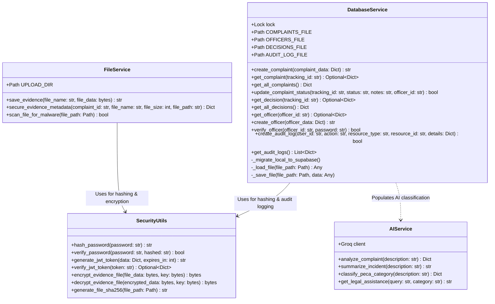

---

## 3. Component & Data Flow Diagram

This diagram displays how frontend pages, UI views, backend routers, services, database tables, and JSON cache files connect.

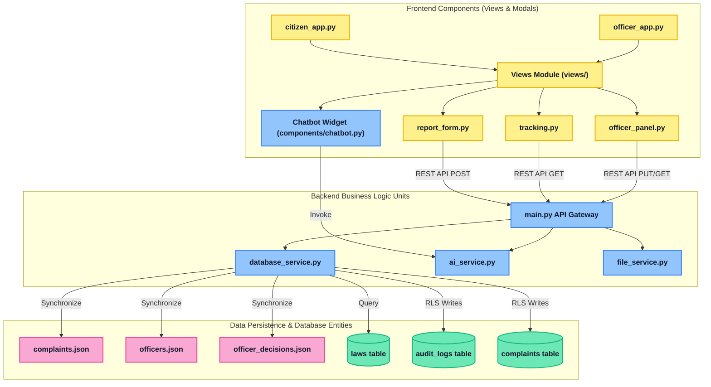

---

## 4. Implementation Plan (Development Roadmap) Diagram

This Gantt chart reflects the structured developmental steps, tasks, milestones, and timelines for building the system.

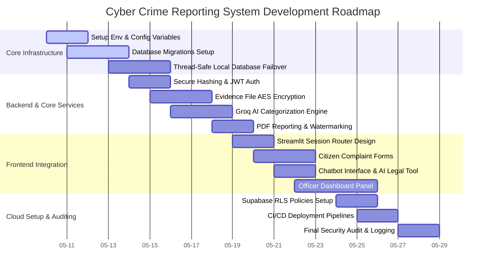

---

## 5. Sequence Diagram

This sequence diagram visualizes the interactive, step-by-step API transaction flow for a citizen submitting a crime report and a law enforcement officer reviewing the case.

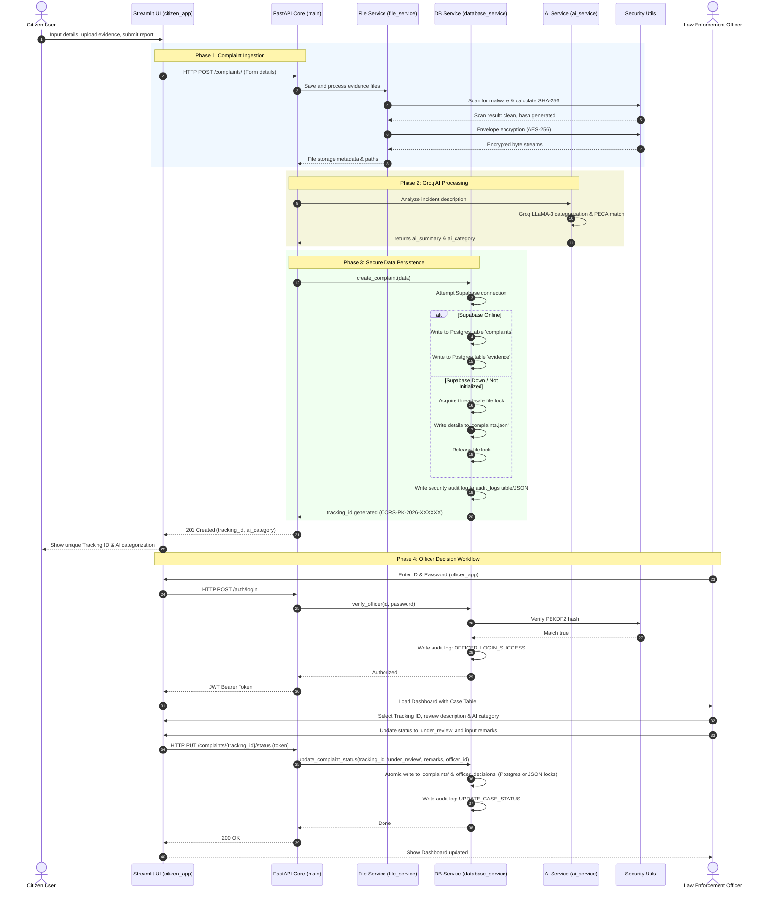

---

## 6. System Architecture Flow Diagram

This flow diagram illustrates the path of a complaint record as it is created, sanitized, categorized, stored, and managed through the system architecture.

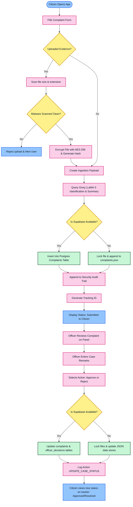

---

## 7. API Routing & Fallback Diagram

This schematic defines the routing configuration for core REST API routes and demonstrates the hybrid database failover model where local, thread-locked JSON databases act as active backups.

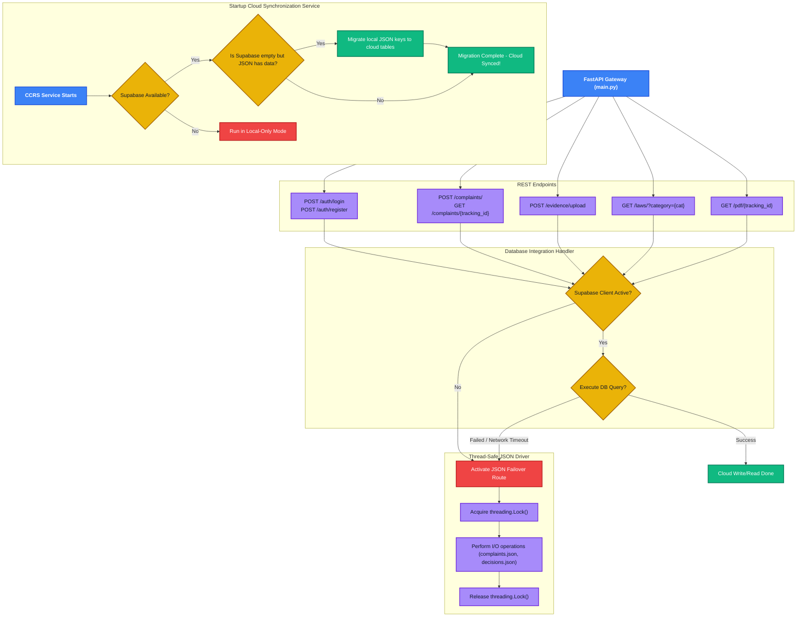

---

## 8. Deployment Architecture

This diagram maps the production deployment environment (using Streamlit Cloud, Render/ECS containers, Supabase Cloud, and Groq AI APIs) alongside development-level local setups.

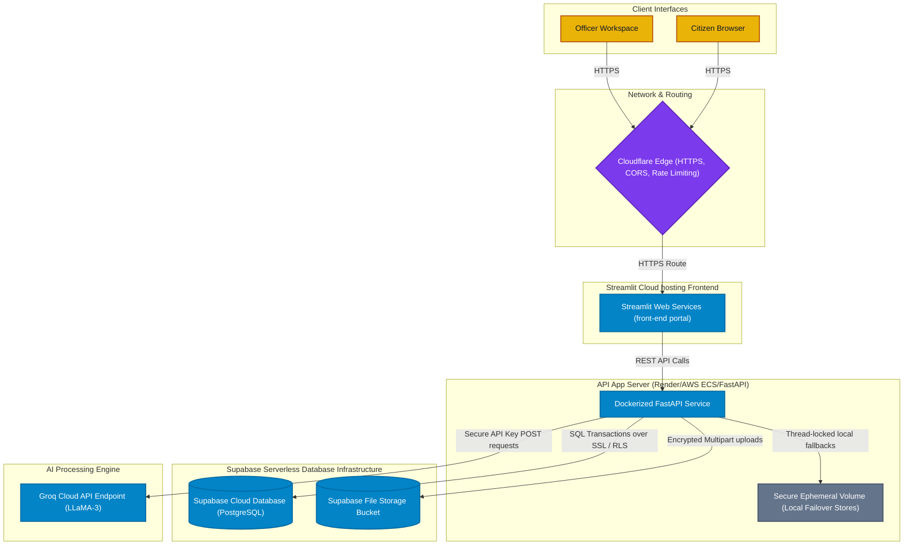

---

## 9. Layer Architecture Overview

This logical model details the five fundamental code layers of the CCRS alongside standard cross-cutting security features.

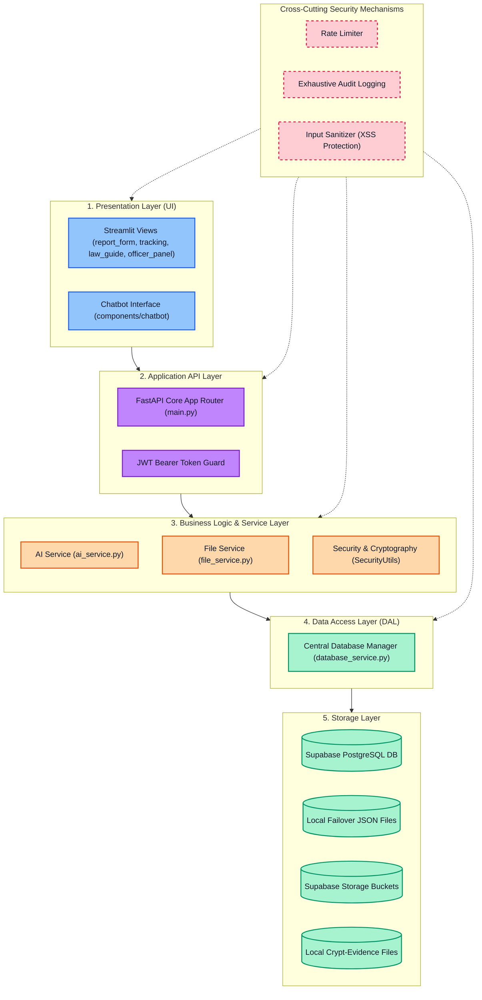

---

## 10. User Roles & Permissions

This permission map defines the operational actions permitted for Citizens (Registered/Anonymous), Law Enforcement Officers, and Administrators.

```mermaid
flowchart TB
    classDef citizen fill:#38bdf8,stroke:#0284c7,stroke-dasharray: 5 5,color:#0f172a;
    classDef officer fill:#a78bfa,stroke:#7c3aed,stroke-dasharray: 5 5,color:#0f172a;
    classDef admin fill:#f43f5e,stroke:#be123c,stroke-dasharray: 5 5,color:#0f172a;
    classDef feature fill:#10b981,stroke:#047857,color:#fff;
    classDef boundary fill:#f8fafc,stroke:#cbd5e1,color:#1e293b;

    CitRole["Citizen / Reporter Role<br>(Anonymous / Registered)"]:::citizen
    OffRole["Law Enforcement Officer Role<br>(CYBER2026xxxx ID)"]:::officer
    AdmRole["System Administrator Role<br>(Admin Token Auth)"]:::admin

    subgraph Guest_Permissions ["Anonymous & Guest Permissions"]
        F1["Submit Incident Reports"]:::feature
        F2["Upload Incident Evidence"]:::feature
        F3["Track Complaints by Tracking ID"]:::feature
        F4["Browse Pakistan Cyber Laws (PECA)"]:::feature
        F5["Use Legal Guidance AI Chatbot"]:::feature
    end

    subgraph Officer_Permissions ["Officer Case Management Permissions"]
        F6["Officer Portal Secure Login"]:::feature
        F7["View Interactive Officer Dashboard"]:::feature
        F8["Review all Registered Complaints"]:::feature
        F9["Update Case Status<br>(Submitted, Under Review, Resolved)"]:::feature
        F10["Record Case Decisions & Remarks"]:::feature
        F11["Download Case PDF Reports"]:::feature
    end

    subgraph Admin_Permissions ["System Administrative Permissions"]
        F12["Register New Law Enforcement Officers"]:::feature
        F13["View Comprehensive Security Audit Logs"]:::feature
        F14["Backend System Configuration Access"]:::feature
        F15["Database Row Level Security (RLS) Override"]:::feature
    end

    %% Mappings
    CitRole --> F1
    CitRole --> F2
    CitRole --> F3
    CitRole --> F4
    CitRole --> F5

    OffRole --> F6
    OffRole --> F7
    OffRole --> F8
    OffRole --> F9
    OffRole --> F10
    OffRole --> F11

    AdmRole --> F12
    AdmRole --> F13
    AdmRole --> F14
    AdmRole --> F15
```

---

## 11. Citizen & Complaint Workflow

This state transition diagram charts the operational and decision workflow for citizens submitting a crime report.

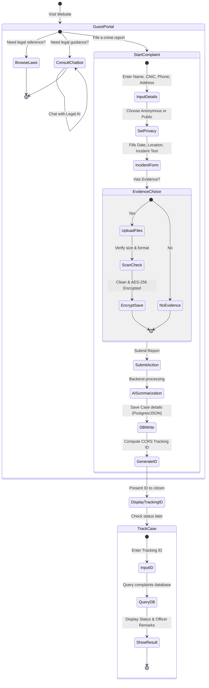

---

## 12. Officer Case Management Workflow

This state diagram visualizes the interactive step-by-step workflow for law enforcement officers logging in and managing citizen reports.

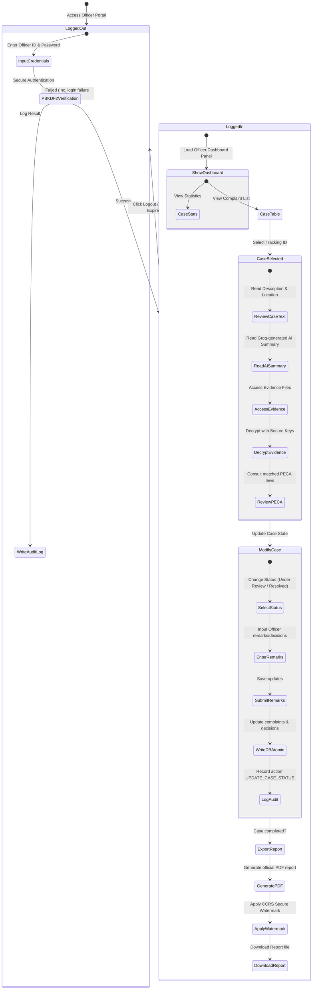

---

## 13. Database Schema & Structure (ERD)

This entity-relationship diagram (ERD) describes the structural organization of your PostgreSQL database tables (from [main_schema.sql](file:///c:/Users/shahz/cyber-crime-reporting-system/database/schemas/main_schema.sql)), columns, primary/foreign keys, and specific security Row Level Security (RLS) policies.

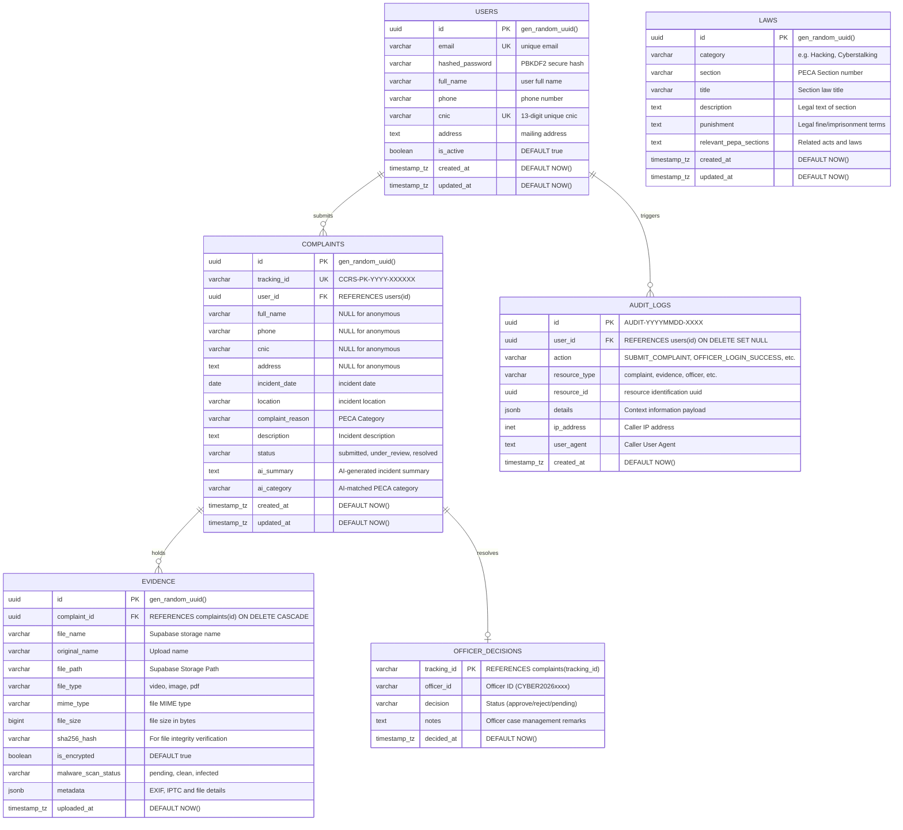

### Table Security Boundaries (Row Level Security - RLS Policies)

*   **`users`**: Enforces strict separation. Only authenticated profiles can read/write their own matching UUID records (`auth.uid() = id`).
*   **`complaints`**: Citizens can select and insert complaints matching their UUID (`auth.uid() = user_id`) or view anonymous entries that match `user_id IS NULL`. 
*   **`evidence`**: Restricts access based on sub-queries. A user can read/write evidence only if they own the related complaint record.
*   **`laws`**: Fully public read access for PECA section browsing (`USING (true)`).
*   **`audit_logs`**: Strictly locked to administrative roles (`auth.users.raw_user_meta_data->>'role' = 'admin'`).

---

## 14. System Components & Modules Map

This component map describes the package, module, directory, and file configuration for both frontend and backend modules.

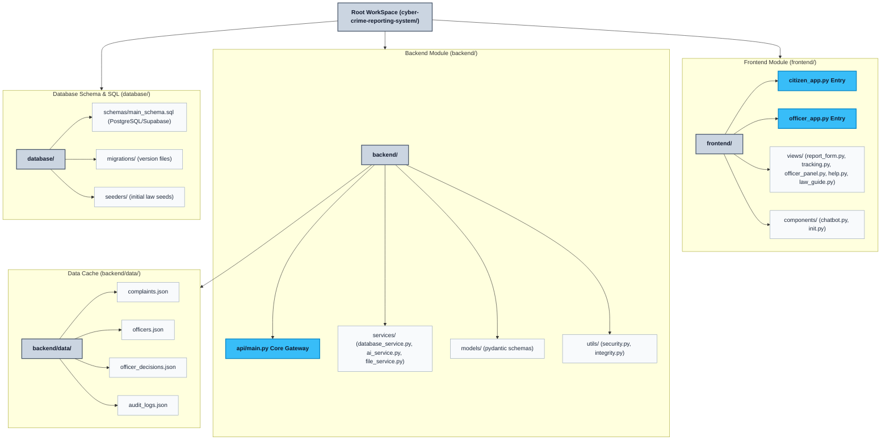

---

## 15. Security Architecture

This layout outlines the defense-in-depth model implemented in the system, ranging from edge rate-limiting to database Row Level Security.

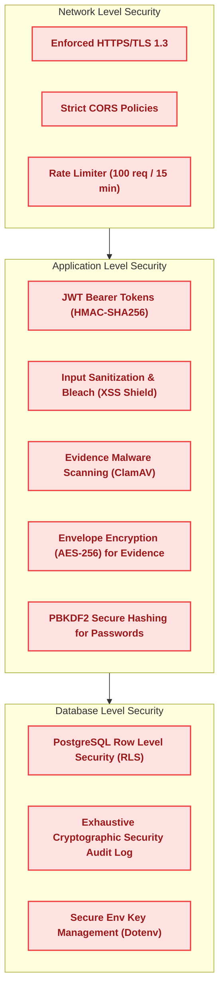

---

## 16. Deployment Pipeline

This schematic traces the automated integration and continuous deployment pipeline (CI/CD) for server and backend builds.

```mermaid
flowchart LR
    classDef stage fill:#f1f5f9,stroke:#64748b,stroke-width:2px,color:#0f172a;
    classDef active fill:#e0f2fe,stroke:#0284c7,stroke-width:2px,color:#0369a1,font-weight:bold;
    classDef final fill:#dcfce7,stroke:#15803d,stroke-width:2px,color:#166534,font-weight:bold;

    Commit["1. git commit & push"]:::stage
    --> Lint["2. Linting & Formatting<br>(Black, Flake8, Ruff)"]:::stage
    --> Test["3. Run Automated Tests<br>(pytest / coverage)"]:::stage
    --> Build["4. Docker Build Image<br>(Multi-stage builds)"]:::active
    --> DeployFE["5. Deploy Streamlit Frontend<br>(Streamlit Cloud)"]:::active
    --> DeployBE["6. Deploy FastAPI Backend<br>(Render / ECS)"]:::active
    --> Migrate["7. Apply DB Migrations<br>(Supabase Postgres)"]:::active
    --> Complete["8. Monitoring & Incident Alerting<br>(Sentry / Logs)"]:::final
```

---

## 17. User Interaction Diagram

This visualizes user navigation paths, pages, actions, and reactions when interacting with interactive form controls.

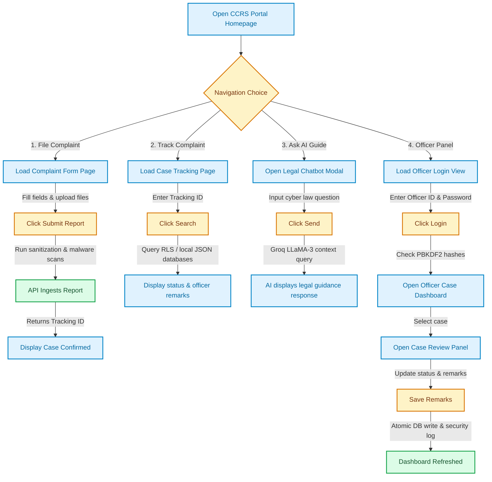

---

## 18. Feature & Capability Matrix

This matrix describes the functional capabilities, authorization, data endpoints, and security mechanisms of each user class in the Cyber Crime Reporting System.

| Functional Feature | Allowed Roles | Service Layer / Module | Data Target (Database / File) | Security Check & Verification |
| :--- | :--- | :--- | :--- | :--- |
| **Submit Incident Report** | Citizen / Anonymous | `FastAPI Core`, `DatabaseService` | `complaints` table / `complaints.json` | Cross-Origin Policy, Input bleach sanitization, API rate-limiting |
| **Browse Pakistan Cyber Laws** | Public Guest | `FastAPI Core`, `main_schema.sql` | `laws` table | Read-Only database connection, Public GET endpoint |
| **Consult Legal AI Chatbot** | Public Guest | `AIService` (Groq API) | LLM context prompts | Dynamic prompt sanitization, rate-limiter |
| **Upload Evidence Files** | Citizen / Anonymous | `FileService`, `SecurityUtils` | `Supabase Storage` / Local FS | File-extension validation, ClamAV antivirus scan, AES-256 Envelope Encryption, SHA-256 integrity hash |
| **Track Complaint Status** | Citizen / Anonymous | `DatabaseService` | `complaints` & `officer_decisions` | Strict 18-character tracking ID format check, Read-Only GET |
| **Officer Portal Login** | Enforcement Officer | `DatabaseService`, `SecurityUtils` | `officers` table / `officers.json` | Officer ID verification, PBKDF2 cryptography hash matching, JWT Auth Token generation |
| **Interactive Dashboard & Statistics** | Enforcement Officer | `FastAPI Core`, `DatabaseService` | `complaints` table counts | Strict JWT token verification, HTTPS endpoint |
| **Review Complaints & Remarks** | Enforcement Officer | `DatabaseService`, `AIService` | `complaints` table + AI Summary | JWT verification, active database query over secure channel |
| **Update Case Status & Decisions** | Enforcement Officer | `DatabaseService` | `complaints` & `officer_decisions` | JWT role matching, thread-safe transactional updates with cross-thread files locks |
| **Generate Case PDF Report** | Enforcement Officer | `FastAPI Core`, `pdf_service` | Dynamic memory generation | JWT authentication, official watermarking logic |
| **Register Officers & Configuration** | System Admin | `DatabaseService` | `officers` table | Admin UUID session validation, Row Level Security bypass |
| **Inspect System Security Audit Log** | System Admin | `DatabaseService` | `audit_logs` table / `audit_logs.json` | RLS check (`role = 'admin'` metadata match in JWT payload) |
