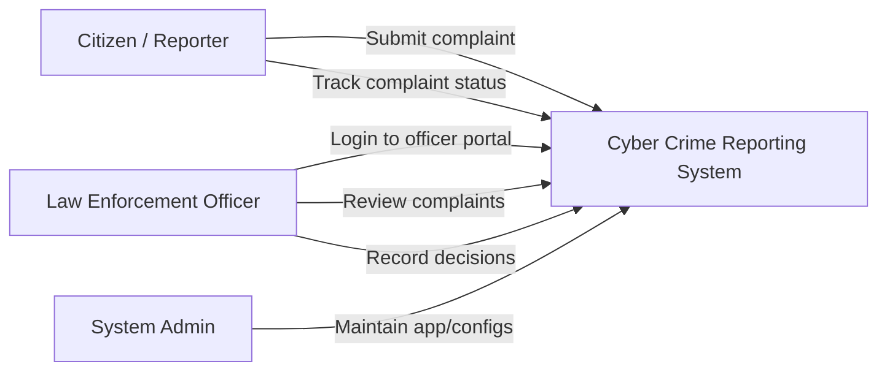
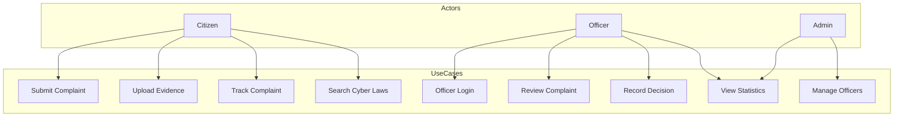
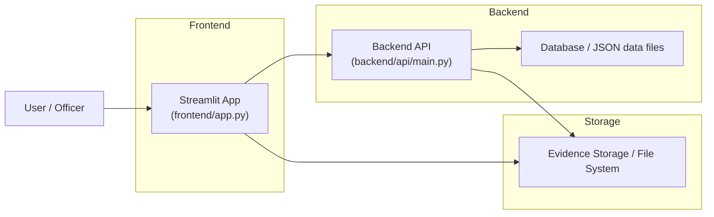
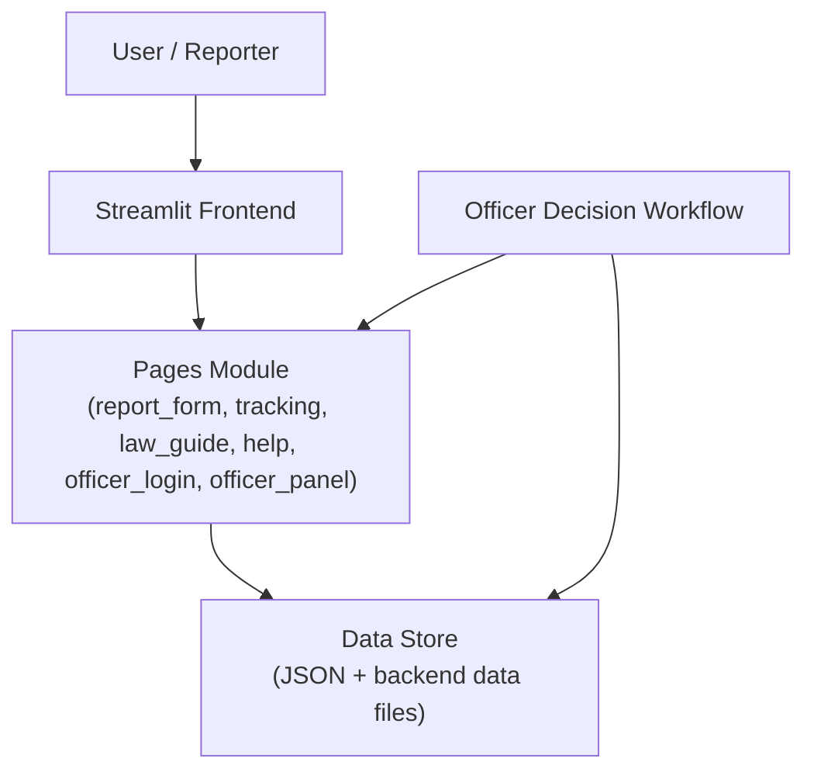
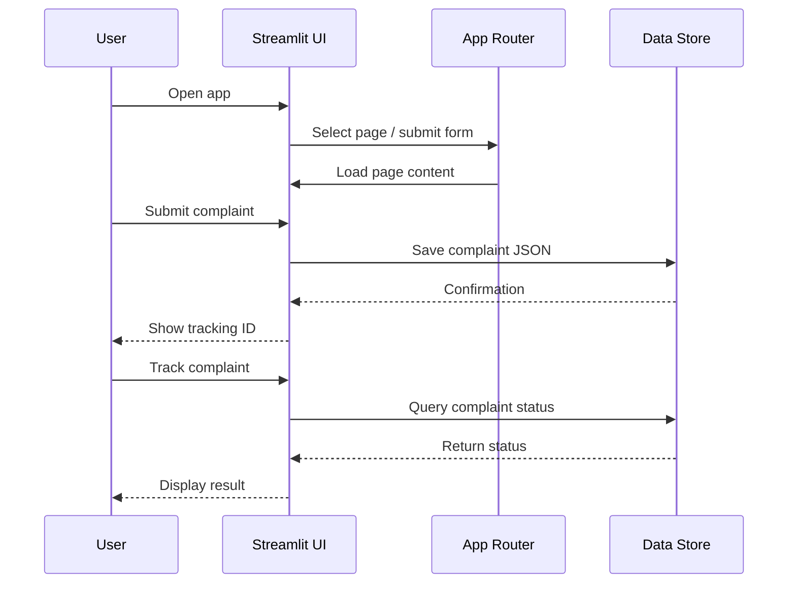

# System Diagrams and Workflow Documentation

This file documents the main system diagrams for the Cyber Crime Reporting System, including user roles, use cases, architecture, system components, and working flow.

## 1. User/Actor Diagram

## 2. Use Case Diagram

## 3. Architecture Diagram

## 4. System Diagram

## 5. Working Flow Diagram

## Notes

- The diagrams are intentionally simplified for documentation and architecture planning.
- The app uses JSON-based local data storage for complaint and officer records.
- The frontend routes pages through a session-state-based single-page router.
- Uploaded evidence is managed by the frontend and persisted as secure evidence files in storage.
